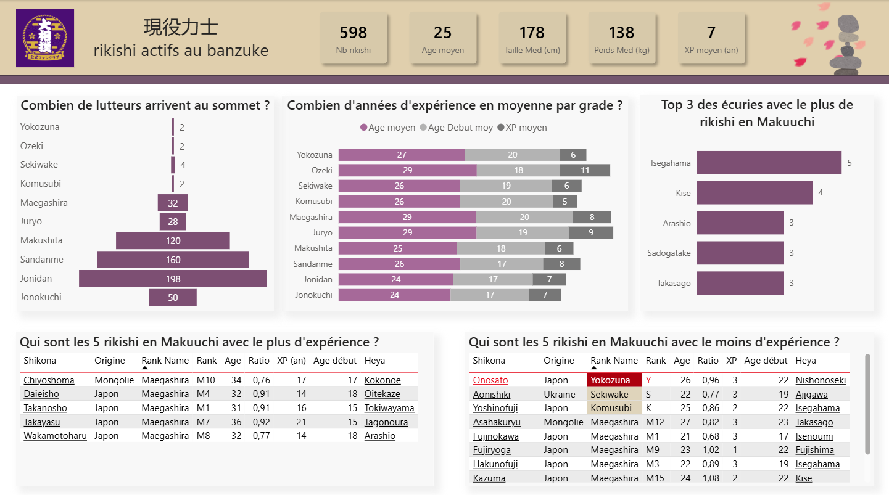
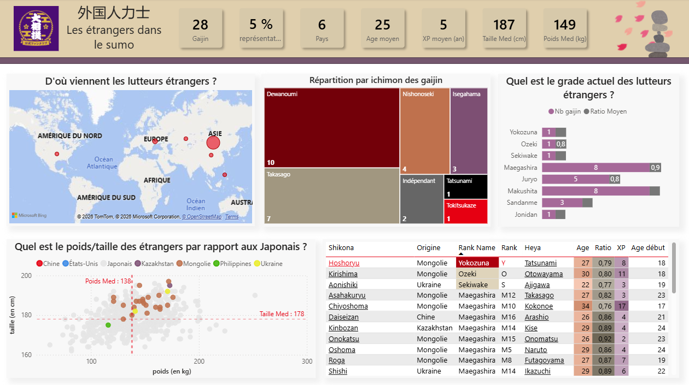
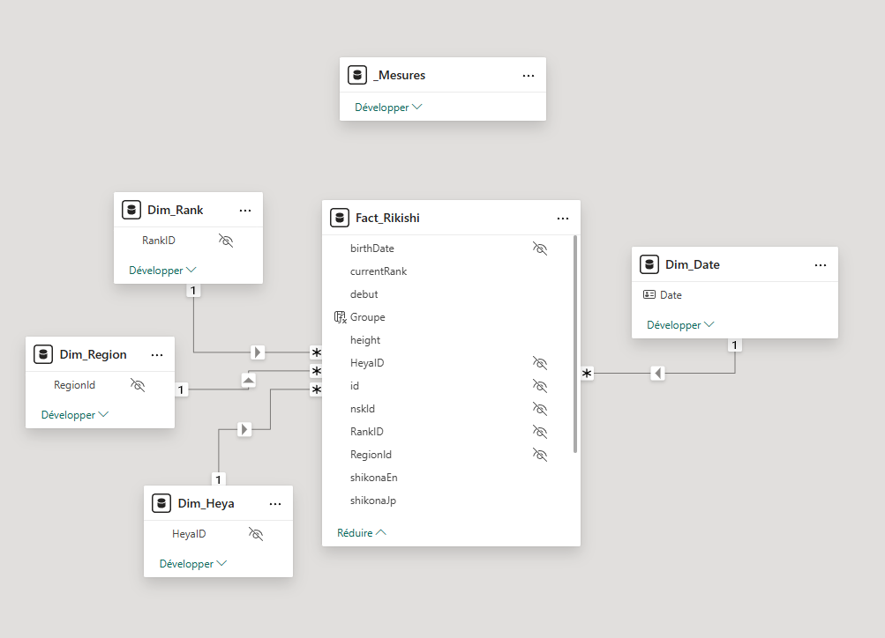
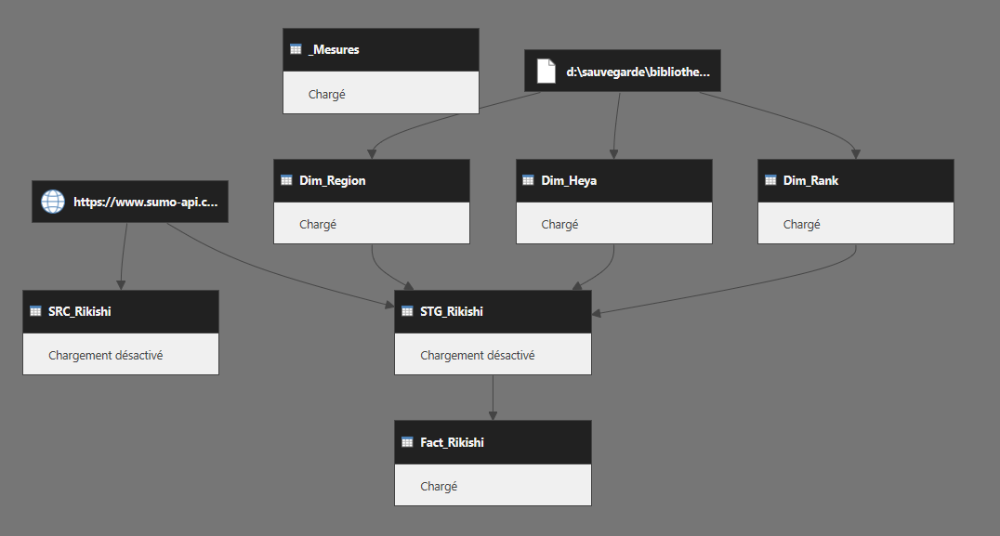

# 大相撲 — Sumo Dashboard

> Dashboard Power BI analysant les rikishi actifs au dernier banzuke  
> Données chargées en direct via l'API REST [sumo-api.com](https://www.sumo-api.com)

---

## Introduction
Suite à l'obtention de la certification PL-300 je voulais créer un premier projet personnel :
J'ai choisi le Sumo à la fois par passion et aussi pour les données qui sont constamment en mouvement, riches et originales.  

L'objectif était de construire un modèle propre en respectant au mieux les best practices : schéma en étoile, récupération de données par API, documenter chaque étape.

Les données de référence (hiérarchie des rangs, écuries, origines géographiques) ont été enrichies manuellement dans un fichier Excel pour compléter celles de l'API et permettre d'étendre les possibilités dans la création du dashboard.

---

## Pages

| Page | Description |
|---|---|
| **現役力士 - Banzuke** | Vue globale des 600+ rikishi actifs : répartition par rang, expérience, physique par division, topN, ancienneté |
| **外国人力士 - Gaijin** | Analyse des lutteurs étrangers : origines, répartition par rang et ichimon, comparaison physique vs japonais |

---

## Stack technique

| Composant | Détail |
|---|---|
| **Source** | API REST `sumo-api.com` (JSON) + fichier Excel de référence |
| **Transformation** | Power Query M -  SRC-STG-Fact |
| **Modélisation** | Schéma en étoile - 1 fact table + 3 dimensions |
| **Calculs** | DAX - `AVERAGEX`, `CALCULATE`, `DIVIDE`, `MEDIAN`, `DATEDIFF`, liens Web |
| **Outil** | Power BI Desktop |
| **Illustrations** | [irasutoya.com](https://www.irasutoya.com/) |

---

## Aperçu

### 現役力士 - Rikishi actifs au banzuke

### 外国人力士 - Les étrangers dans le sumo

---

## Modèle de données

### Schéma en étoile

### Dépendances Power Query

---

## Sources

| Source | Usage |
|---|---|
| [sumo-api.com](https://www.sumo-api.com) | Données rikishi actifs (API REST JSON) |
| [sumo.or.jp](https://www.sumo.or.jp) | Fiches officielles NSK (liens depuis le rapport) |
| [sumodb.sumogames.de](https://sumodb.sumogames.de) | Base historique (liens depuis le rapport) |
| [irasutoya.com](https://www.irasutoya.com) | Illustrations libres de droits |
